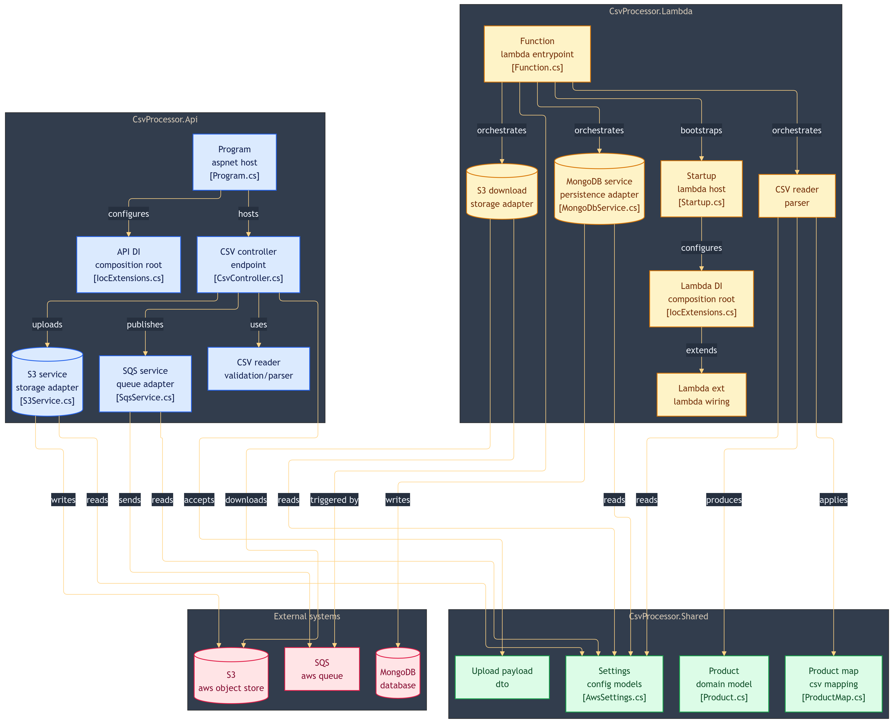

# CsvProcessor

A .NET 10 solution demonstrating CSV processing with AWS services using local emulators. The API receives a CSV file, uploads it to S3-compatible storage, and publishes a message to an SQS queue. A Lambda function consumes the queue, downloads the file, parses it with CsvHelper, and persists the records to MongoDB.

## Solution Structure

| Project | Responsibility |
|---|---|
| `CsvProcessor.Api` | ASP.NET Core Web API — receives CSV upload, stores in RustFS, publishes to ElasticMQ |
| `CsvProcessor.Lambda` | AWS Lambda function — consumes SQS event, reads CSV, persists to MongoDB |
| `CsvProcessor.Shared` | Models, DTOs, mappings and settings shared between projects |

## Flow

```
HTTP Upload (IFormFile)
    → CsvReaderService (count records)
    → S3Service (upload to RustFS)
    → SqsService (publish CsvUploadPayload to ElasticMQ)
        → Lambda FunctionHandler (SQSEvent)
            → S3DownloadService (download CSV from RustFS)
            → CsvReaderService (parse records)
            → MongoDbService (insert into MongoDB)
```

## Architecture Diagram


## Prerequisites

- [.NET 10 SDK](https://dotnet.microsoft.com/download/dotnet/10.0)
- [Docker](https://www.docker.com/)
- [Amazon.Lambda.TestTool](https://github.com/aws/aws-lambda-dotnet/tree/master/Tools/LambdaTestTool)

```bash
dotnet tool install -g Amazon.Lambda.TestTool
```

## Local Infrastructure

This project uses the following local emulators instead of real AWS services:

| Service | Emulator | Default Port |
|---|---|---|
| S3 | [RustFS](https://github.com/rustfs/rustfs) | `9000` |
| SQS | [ElasticMQ](https://github.com/softwaremill/elasticmq) | `9324` |
| MongoDB | MongoDB Community | `27017` |

### RustFS (S3 emulator)

RustFS is a high-performance, S3-compatible object storage server written in Rust. It is used here as a local replacement for AWS S3.

```bash
docker run --name RustFS -d -p 9000:9000 -p 9001:9001 -v $(pwd)/data:/data -v $(pwd)/logs:/logs rustfs/rustfs:latest
```

After starting, access the console at `http://localhost:9001` and create a bucket named `csv-uploads`.

### ElasticMQ (SQS emulator)

ElasticMQ is an in-memory message queue server with an Amazon SQS-compatible interface. It is used here as a local replacement for AWS SQS.

```bash
docker run --name ElasticMQ -p 9324:9324 -p 9325:9325 -v `pwd`/custom.conf:/opt/elasticmq.conf -d softwaremill/elasticmq-native
```

After starting, access the UI at `http://localhost:9325` and create a queue named `csv-processor`.

### MongoDB

```bash
docker run --name MongoDB -d -p 27017:27017 -e MONGO_INITDB_ROOT_USERNAME=youruser -e MONGO_INITDB_ROOT_PASSWORD=yourpassword -d mongo
```

## Configuration

**`CsvProcessor.Api/appsettings.json`:**

```json
{
  "AWS": {
    "ServiceURL": "http://localhost:9000",
    "AuthenticationRegion": "us-east-1",
    "AccessKey": "minioadmin",
    "SecretKey": "minioadmin"
  },
  "SQS": {
    "QueueUrl": "http://localhost:9324/queue/csv-processor"
  },
  "S3": {
    "BucketName": "csv-uploads"
  }
}
```

**`CsvProcessor.Lambda/appsettings.json`:**

```json
{
  "AWS": {
    "ServiceURL": "http://localhost:9000",
    "AuthenticationRegion": "us-east-1",
    "AccessKey": "minioadmin",
    "SecretKey": "minioadmin"
  },
  "MongoDB": {
    "ConnectionString": "mongodb://localhost:27017",
    "DatabaseName": "CsvProcessor",
    "CollectionName": "Produtos"
  },
  "S3": {
    "BucketName": "csv-uploads"
  }
}
```

## Running the API

```bash
dotnet run --project src/CsvProcessor.Api
```

## Endpoints

Base URL: `http://localhost:5000`

| Method | Route | Description |
|---|---|---|
| `POST` | `/api/csv/upload` | Upload a CSV file (`multipart/form-data`) |

## Testing the Lambda Locally

1. Upload a CSV via the API to get a real `S3Key` from the response.

2. Start the Mock Lambda Test Tool:

```bash
cd src/CsvProcessor.Lambda/src/CsvProcessor.Lambda
dotnet build
dotnet lambda-test-tool start --lambda-emulator-port 5050
```

3. Open `http://localhost:5050`, select `FunctionHandler` and use the SQS event payload below, replacing the `S3Key` with the one returned by the upload endpoint:

```json
{
  "Records": [
    {
      "messageId": "19dd0b57-b21e-4ac1-bd88-01bbb068cb78",
      "receiptHandle": "MessageReceiptHandle",
      "body": "{\"S3Key\":\"products/2026/04/30/b5321325-e1be-4408-9d98-0c28426d79b3-sample.csv\",\"FileName\":\"sample.csv\",\"UploadedAt\":\"2026-04-29T10:00:00Z\",\"TotalRecords\":3}",
      "attributes": {
        "ApproximateReceiveCount": "1",
        "SentTimestamp": "1523232000000",
        "SenderId": "123456789012",
        "ApproximateFirstReceiveTimestamp": "1523232000001"
      },
      "messageAttributes": {},
      "md5OfBody": "7b270e59b47ff90a553787216d55d91d",
      "eventSource": "aws:sqs",
      "eventSourceARN": "arn:aws:sqs:us-east-1:123456789012:csv-processor",
      "awsRegion": "us-east-1"
    }
  ]
}
```

## CSV Format

```csv
Id,Name,Price,Amount,Category,CreatedAt
1,Teclado Mecânico,350.90,15,Periféricos,2024-01-10
2,Monitor 24pol,899.00,8,Monitores,2024-02-15
3,Mouse Sem Fio,129.50,30,Periféricos,2024-03-01
4,Headset Gamer,249.90,20,Áudio,2024-03-15
5,Webcam Full HD,199.00,12,Periféricos,2024-04-01
```

## NuGet Packages

**`CsvProcessor.Api`**

| Package | Version |
|---|---|
| AWSSDK.S3 | 4.0.22.1 |
| AWSSDK.SQS | 4.0.2.27 |
| Microsoft.AspNetCore.OpenApi | 10.0.7 |
| MongoDB.Driver | 3.8.0 |
| Scalar.AspNetCore | 2.14.8 |

**`CsvProcessor.Lambda`**

| Package | Version |
|---|---|
| Amazon.Lambda.Annotations | 1.15.1 |
| Amazon.Lambda.Core | 2.8.1 |
| Amazon.Lambda.Serialization.SystemTextJson | 2.4.5 |
| Amazon.Lambda.SQSEvents | 2.2.1 |
| AWSSDK.S3 | 4.0.22.1 |
| CsvHelper | 33.1.0 |
| Microsoft.Extensions.Configuration.Json | 10.0.7 |
| Microsoft.Extensions.Hosting | 10.0.7 |
| Microsoft.Extensions.Options | 10.0.7 |
| MongoDB.Driver | 3.8.0 |

**`CsvProcessor.Shared`**

| Package | Version |
|---|---|
| CsvHelper | 33.1.0 |

## References

- [Use MongoDB with ASP.NET Core — Microsoft Docs](https://learn.microsoft.com/en-us/aspnet/core/tutorials/first-mongo-app?view=aspnetcore-10.0&tabs=visual-studio)
- [Working with AWS S3 using ASP.NET Core — Code with Mukesh](https://codewithmukesh.com/blog/working-with-aws-s3-using-aspnet-core/)
- [Amazon SQS and ASP.NET Core — Code with Mukesh](https://codewithmukesh.com/blog/amazon-sqs-and-aspnet-core/)
- [.NET and AWS S3 with LocalStack — Genezini Blog](https://blog.genezini.com/p/dotnet-and-aws-s3-with-localstack-how-to-develop-with-local-s3-buckets/)
- [CsvHelper — Getting Started](https://joshclose.github.io/CsvHelper/getting-started/)
- [Simple Dependency Injection for .NET Lambda Functions — No Dogma Blog](https://nodogmablog.bryanhogan.net/2022/10/simple-dependency-injection-for-net-lambda-functions/)
- [YouTube — AWS Lambda with .NET walkthrough](https://youtu.be/oAXB_QB3jAk?si=eYN6eRAI-x7GJOxb)
- [RustFS — S3-compatible object storage](https://github.com/rustfs/rustfs)
- [ElasticMQ — SQS-compatible message queue](https://github.com/softwaremill/elasticmq)